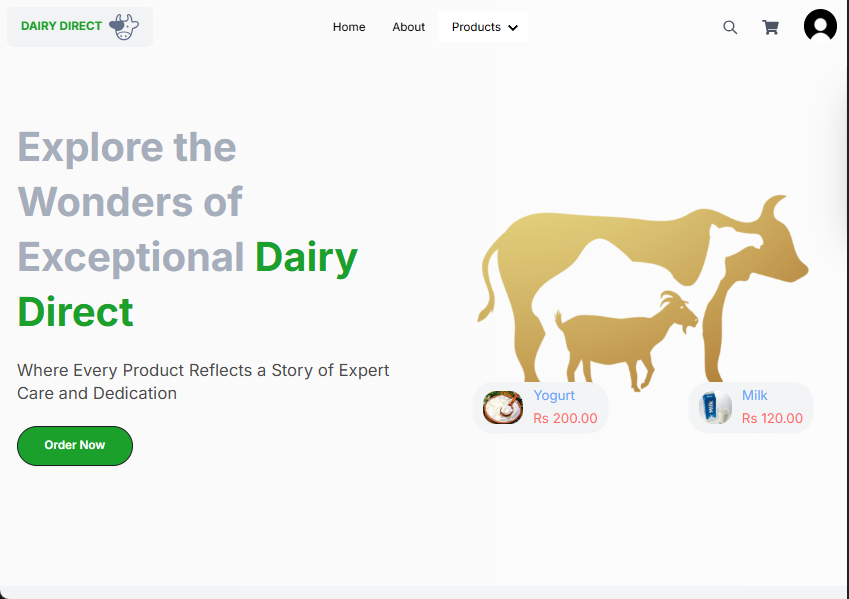
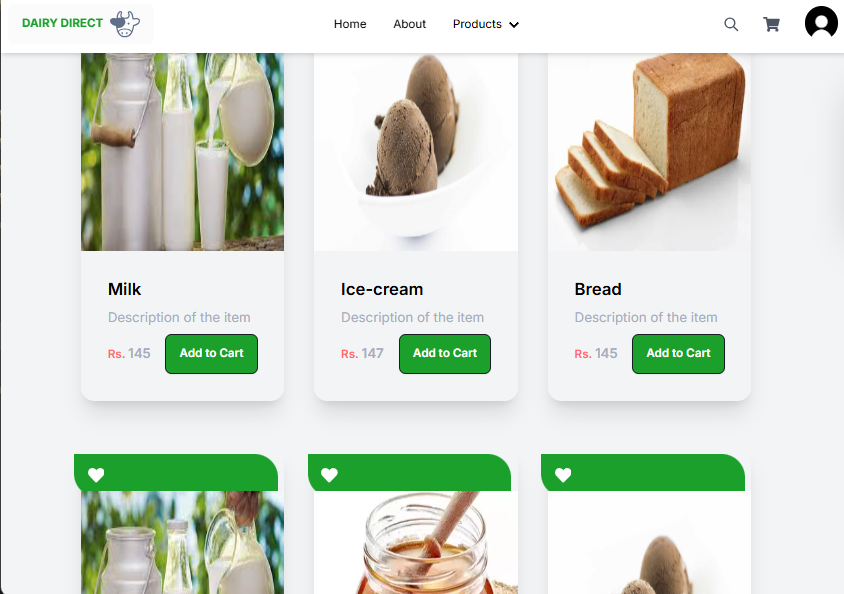
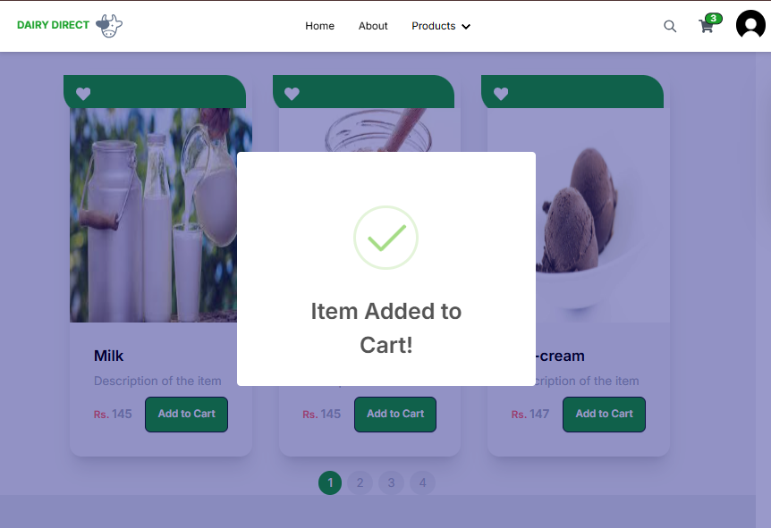

<h1 align="center">Dairy Direct</h1>
A Front End webpage designed to manage dairy products and services. It provides a user-friendly interface for customers to browse products, place orders, and manage their profiles..

## Features
- Browse dairy products
- Place and manage orders
- Secure authentication and authorization
- User profile management
- Responsive and user-friendly interface

## Technologies Used
- **Frontend**: React, Vite, Tailwind CSS, Axios
- **Backend**: Node.js, Express, MongoDB, Mongoose, JWT

## Installation
To install and set up the project locally, follow these steps:

### Clone the Repository
```bash
git clone <repository-url>
```

### Install Dependencies
#### Frontend Setup
```bash
cd dairyguard-client
npm install
```

#### Backend Setup
```bash
cd ../dairyguard-server
npm install
```

## Usage
### Running the Frontend
```bash
cd dairyguard-client
npm run dev
```

### Running the Backend
```bash
cd dairyguard-server
npm start
```

## Folder Structure
```
dairyguard-client/
├── public/                # Static assets
├── src/                   # Source code
│   ├── components/        # React components
│   ├── pages/             # Application pages
│   ├── hooks/             # Custom hooks
│   └── App.jsx            # Main application file
└── index.html             # Entry point for the application

dairyguard-server/
├── api/                   # API routes and controllers
├── models/                # Database models
└── index.js               # Main server file
```






